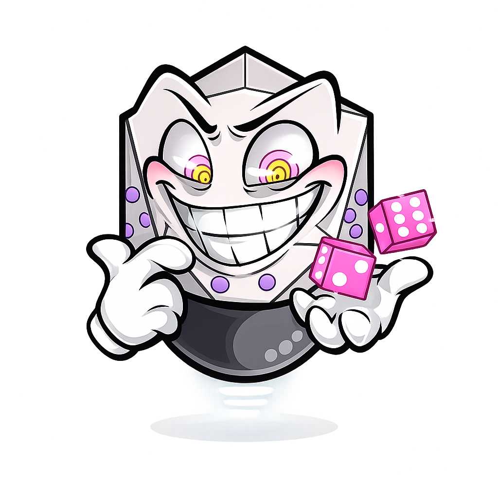

<div align="center">



# Wolf Dice Bot

A multiplayer dice game bot for [wolf.live](https://wolf.live) chat platform

[](https://github.com/fawazorg/wolf-dice-bot)
[](LICENSE)
[](https://nodejs.org)

[Features](#features) • [Installation](#installation) • [Commands](#commands) • [Game Flow](#game-flow) • [Architecture](#architecture)

</div>

---

## Overview

Wolf Dice Bot is an interactive multiplayer dice game bot built for wolf.live chat platform. Players compete in turn-based dice rolling matches with betting mechanics, guessing phases, and PvP battles. The bot features multi-account support, persistent player statistics, and bilingual support (English/Arabic).

## Features

- **Multiplayer Gameplay**: Support for multiple players in turn-based matches
- **Betting System**: Strategic betting with configurable balance limits (500-5000 coins in multiples of 500)
- **Multi-Phase Game**: Joining → Guessing → Picking → Betting → Rolling → Scoring
- **Player Statistics**: Persistent rank tracking and leaderboards via MongoDB
- **Multi-Language**: Full English and Arabic language support
- **Multi-Account**: Run multiple bot accounts simultaneously
- **Auto-Management**: Automatic cleanup of inactive game channels
- **Dice Statistics**: Track dice roll history and patterns per player

## Installation

### Prerequisites

- Node.js >= 18.0.0
- Docker and Docker Compose (for MongoDB and Redis)
- Wolf.live account(s) for the bot

### Quick Start

1. **Clone the repository**

   ```bash
   git clone https://github.com/fawazorg/wolf-dice-bot.git
   cd wolf-dice-bot
   ```

2. **Install dependencies**

   ```bash
   npm install
   ```

3. **Configure environment**

   Create a `.env` file in the project root (see [.env.example](.env.example) for full reference):

   ```env
   # ============================================
   # Bot Account Configuration
   # ============================================
   # Pipe-separated list of bot accounts (email:password|email:password)
   ACCOUNTS=email1:password1|email2:password2

   # ============================================
   # MongoDB Root Configuration
   # ============================================
   ROOT_USERNAME=admin
   ROOT_PASSWORD=your_secure_root_password
   ROOT_DATABASE=admin

   # ============================================
   # MongoDB Application Database
   # ============================================
   MONGO_USER=dice_user
   MONGO_PWD=your_secure_app_password
   MONGO_DB_NAME=wolf_dice

   ```

4. **Start infrastructure**

   ```bash
   docker-compose up -d
   ```

5. **Run the bot**

   ```bash
   # Development mode with auto-reload
   npm run dev

   # Production mode
   npm start
   ```

## Commands

### Player Commands

| Command               | Description                                | Example          |
| --------------------- | ------------------------------------------ | ---------------- |
| `!dice new <balance>` | Create a new game with initial balance     | `!dice new 2000` |
| `!dice join`          | Join an existing game in the joining phase | `!dice join`     |
| `!dice cancel`        | Cancel the current game (creator only)     | `!dice cancel`   |
| `!dice balance`       | Check your current game balance            | `!dice balance`  |
| `!dice show`          | Display all players in the current game    | `!dice show`     |
| `!dice rank`          | View your rank and total points            | `!dice rank`     |
| `!dice status`        | View your dice roll statistics             | `!dice status`   |
| `!dice top`           | Display top 10 players leaderboard         | `!dice top`      |
| `!dice help`          | Show help menu                             | `!dice help`     |

### Admin Commands

| Command                      | Description                            |
| ---------------------------- | -------------------------------------- |
| `!dice admin join <groupID>` | Make the bot join a specific group     |
| `!dice admin refresh`        | Update last active date for all groups |
| `!dice admin count`          | Get total group count                  |
| `!dice admin help`           | Show admin help menu                   |

## Game Flow

### 1. Joining Phase (30 seconds)

- A player creates a game with `!dice new <balance>`
- Balance must be in multiples of 500 (max 5000)
- Other players join using `!dice join`
- Game starts automatically when time expires

### 2. Guessing Phase (15 seconds)

- All players guess a dice number (1-50)
- Players who guess correctly earn 500 bonus points
- Used to determine turn order

### 3. Picking Phase (15 seconds)

- Players take turns picking opponents for PvP matches
- Turn order based on dice rolls from guessing phase
- Auto-selection if only one opponent available

### 4. Betting Phase

- Players bet coins in multiples of 500
- Maximum bet limited to player's current balance
- Minimum bet: 500 coins

### 5. Rolling Phase

- Both players roll dice (1-6)
- Higher roll wins the bet amount from opponent
- Ties result in a replay of the round

### 6. Scoring & Elimination

- Players with zero balance are eliminated
- Game continues until one player remains
- Winner and runner-ups are announced

## Architecture

### Project Structure

```
wolf-dice-bot/
├── src/
│   ├── core/              # Pure game logic (no external dependencies)
│   │   ├── Game.js        # Central game state manager
│   │   ├── Player.js      # Player balance and status
│   │   ├── Channel.js     # Channel management
│   │   ├── Dice.js        # Dice rolling mechanics
│   │   └── GameState.js   # Game phase constants
│   ├── managers/          # Integration layer
│   │   └── GameManager.js # Bridges core logic with WOLF platform
│   ├── services/          # External services
│   │   └── MessageService.js # Multi-language message handling
│   ├── database/          # Database layer
│   │   ├── helpers/       # Database helper functions
│   │   │   ├── group.js   # Group activity tracking
│   │   │   └── player.js  # Player scoring and ranking
│   │   └── models/        # Mongoose schemas
│   ├── utils/             # Utility functions
│   │   ├── Random.js      # Random number generation
│   │   ├── config.js      # Environment variable parsing
│   │   └── authorization.js # Admin authorization
│   ├── commands/          # Command handlers
│   │   ├── admin/         # Admin-specific commands
│   │   └── *.js           # Player commands
│   ├── jobs/              # Scheduled tasks
│   ├── bot/               # Bot client
│   │   └── DiceClient.js  # WOLF client wrapper
│   └── main.js            # Application entry point
├── phrases/               # Localization files
│   ├── en.json           # English messages
│   └── ar.json           # Arabic messages
├── config/
│   └── default.yaml      # Bot configuration
├── docker/
│   └── mongodb/          # MongoDB initialization
│       ├── init-db.sh    # User creation script
│       └── README.md     # MongoDB setup docs
├── assets/
│   └── logo.png          # Bot logo
└── docker-compose.yml    # Infrastructure setup
```

### Design Patterns

#### Layered Architecture

- **Core Layer**: Pure game logic, framework-agnostic
- **Manager Layer**: Integration between core and WOLF platform
- **Service Layer**: External integrations (database, messaging)
- **Command Layer**: User-facing command handlers

#### Multi-Account Support

- Accounts configured via `ACCOUNTS` environment variable
- Each account gets isolated diceClient instance
- 500ms staggered login to prevent rate limiting

#### Message Localization

- All user messages stored in `phrases/{language}.json`
- MessageService handles phrase lookup and placeholder replacement
- Per-channel language configuration

## Configuration

### Bot Settings (`config/default.yaml`)

```yaml
keyword: dice # Bot command prefix
app:
  defaultLanguage: en # Default language (en/ar)
  developerId: 82366923 # Admin user ID
  commandSettings:
    ignoreOfficialBots: true
    ignoreUnofficialBots: true
  networkSettings:
    retryMode: 1
    retryAttempts: 1

admin:
  # Array of admin user IDs with elevated permissions
  adminIds: [12345678, 87654321]

  # Admin group ID for bot notifications and logs
  adminGroupId: 11111111

  # Array of group IDs to never auto-leave due to inactivity
  ignoreGroupIds: [11111111, 22222222]

redis:
  host: localhost
  port: 6379
```

### Game Rules

- **Balance Range**: 500 - 5000 coins (multiples of 500)
- **Guess Range**: 1 - 50
- **Dice Range**: 1 - 6
- **Phase Timeouts**:
  - Joining Phase: 30 seconds
  - Guessing Phase: 15 seconds
  - Picking Phase: 15 seconds
  - Rolling Phase: Unlimited (manual trigger)
- **Guess Reward**: 500 coins for correct guess

## Development

### Scripts

```bash
# Start with auto-reload
npm run dev

# Lint code
npm run lint

# Auto-fix linting issues
npm run lint:fix
```

### Code Conventions

- **ES Modules**: All files use `.js` with `import/export`
- **JSDoc**: Comprehensive documentation on all public methods
- **Private Fields**: Use `#fieldName` for encapsulation
- **Error Handling**: Methods return `{success: boolean, error?: string}`
- **Async/Await**: All I/O operations use async/await

### Key Technologies

- **[wolf.js](https://www.npmjs.com/package/wolf.js)**: Wolf.live platform SDK
- **[Mongoose](https://mongoosejs.com/)**: MongoDB ODM for data persistence
- **[node-schedule](https://www.npmjs.com/package/node-schedule)**: Cron-like job scheduling
- **[dotenv](https://www.npmjs.com/package/dotenv)**: Environment configuration

## Database Schema

### Player Model

- `subscriberId`: Wolf.live user ID (unique)
- `score`: Total accumulated points
- `diceStats`: Object tracking roll history (1-6)

### Channel Model

- `channelId`: Wolf.live group ID
- `language`: Preferred language (en/ar)
- `lastActiveAt`: Last game activity timestamp

## Troubleshooting

### Bot Not Responding

1. Check if infrastructure is running: `docker-compose ps`
2. Verify environment variables in `.env`
3. Check bot account credentials
4. Review logs for connection errors

### Database Connection Issues

1. Ensure MongoDB container is running
2. Verify MongoDB credentials match `.env` configuration
3. Check network connectivity: `docker network inspect wolf-dice-bot_default`

### Commands Not Working

1. Verify bot has joined the group
2. Check if bot keyword is correct (`dice` by default)
3. Ensure proper command syntax (refer to help menu)

## Contributing

Contributions are welcome. Please:

1. Fork the repository
2. Create a feature branch (`git checkout -b feature/amazing-feature`)
3. Commit your changes (`git commit -m 'Add amazing feature'`)
4. Push to the branch (`git push origin feature/amazing-feature`)
5. Open a Pull Request

## License

This project is licensed under the ISC License - see the [LICENSE](LICENSE) file for details.

## Support

- **Issues**: [GitHub Issues](https://github.com/fawazorg/wolf-dice-bot/issues)
- **Repository**: [github.com/fawazorg/wolf-dice-bot](https://github.com/fawazorg/wolf-dice-bot)

## Acknowledgments

- Built for the [wolf.live](https://wolf.live) community
- Powered by [wolf.js](https://www.npmjs.com/package/wolf.js) SDK

---

<div align="center">

Made with ❤️ by [fawazorg](https://github.com/fawazorg)

</div>
